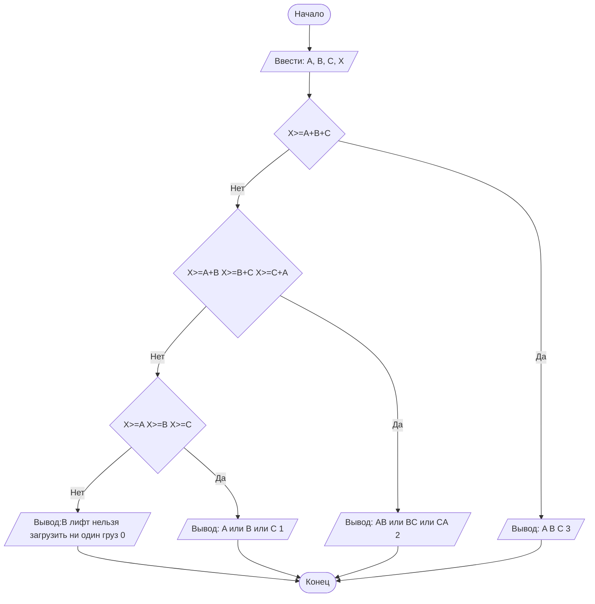

## Отчет по лабораторной работе № 1

#### № группы: `ПМ-2502`

#### Выполнила: `Ремизова Анастасия Александровна`

#### Вариант: `18`

### Cодержание:

- [Постановка задачи](#1-постановка-задачи)
- [Входные и выходные данные](#2-входные-и-выходные-данные)
- [Выбор структуры данных](#3-выбор-структуры-данных)
- [Алгоритм](#4-алгоритм)
- [Программа](#5-программа)
- [Анализ правильности решения](#6-анализ-правильности-решения)
### 1. Постановка задачи

> В лифт с грузоподъёмностью X пытаются загрузить грузы весом A, B, C.
Проверить, какие из грузов могут быть загружены в лифт без превышения
допустимой массы, и определить, сколько грузов можно поместить в лифт.
На вход программы подаются натуральные числа X, A, B, C.

Данную задачу можно разделить на 2 части: проверить грузы по отдельности, проверить поднимет ли лифт грузы вместе

- первая часть проверит помещаются ли грузы A, B, C по отдельности
    
- вторая часть программы проверяет поднимет ли лифт комбинации из 2 и 3 грузов:
  1. `A+B≤X`
  2.  `A+C≤X`
  3. `C+B≤X`
  4. `A+B≤X`
  5. `A+B+C≤X`

  Значит всего нужно рассмотреть 7 случаев: 3 одиночных, 3 по 2 и 1 все три груза.
  ### 2. Входные и выходные данные

#### Данные на вход

На вход программа должна получать 4 числа, при этом в условии сказано, к какому множеству
принадлежат получаемые числа- натуральные, поэтому приствоим им тип целых чисел, тк грузы весят целыми килограммами без грммов.

| Переменная | Тип          | min значение | max значение  |
|------------|--------------|--------------|---------------|
| X          | Целые числа  | 1            | 10<sup>9</sup> |
| A          | Целые числа  | 1            | 10<sup>9</sup> |
| B          | Целые числа  | 1            | 10<sup>9</sup> |
| C          | Целые числа  | 1            |10<sup>9</sup> |


#### Данные на выход

Т.к. программа должна проверить какие грузы могут быть загруженны и вывести количество помещаемых грузов. 

|                   | Тип                         | min значение | max значение   |
|-------------------|-----------------------------|--------------|----------------|
| количество грузов | целое неотрицательное число | 0            | 10<sup> 9</sup>

## 3. Выбор структуры данных

Программа получает 4 целых числа, не превышающих  10<sup>9</sup>. Поэтому для их хранения
можно выделить переменные А, B, C, X.

|   | название переменной | Тип (в Java) | 
|---|---------------------|--------------|
| X | `X`                 | `int`        |
| A | `A`                 | `int`     | 
| B | `B`                 | `int`     | 
| C | `C`                 | `int`     | 

Результаты можно выводить без дополнительного хранения, но для удобства лучше сохранить результаты в переменных.

### 4. Алгоритм

#### Алгоритм выполнения программы:

1. **Ввод данных:**  
   Считываем целые числа X,A,B,C.
2. **Проверка одиночных грузов:**  
   Для каждого груза A,B,C проверяем, меньше ли или равно ли его вес X. Если да — груз можно загрузить по отдельности.
3. **Проверка двойки:**
    - Проверяем сумму весов каждого из трёх возможных пар (A+B),(A+C),(B+C) — не превышает ли она X.
   
4. **Проверка тройки:**
   Проверяем сумму A+B+C — не превышает ли X.
5. **Определение максимального числа грузов:**
   Если можно загрузить все три — выводим 3.
   Иначе если можно загрузить любую пару — 2.
   Иначе если можно загрузить хотя бы один груз — 1.
   Иначе — 0 (ничего не подходит).
6. **Вывод результата:**  
   Выводим максимальное количество грузов, которое можно загрузить в лифт без перегруза.

#### Блок-схема



### 5. Программа
```java
import java.util.Scanner;
public class Main {
            public static void main(String[] args) {
                Scanner in = new Scanner(System.in);
                System.out.print("Введите грузоподъёмность X и веса A, B, C: ");
                int X = in.nextInt(), A = in.nextInt(), B = in.nextInt(), C = in.nextInt();

                String comb = "";
                int max = 0;

                if (A + B + C <= X) { comb = "A B C"; max = 3; }
                else if ((A + B <= X) || (A+C<=X)||(B + C <= X)) {
                    max = 2;
                    if (A + B <= X) comb = "A B";
                    else if (A + C <= X) comb = "A C";
                    else comb = "B C";
                }
                else if ((A <= X)||(B<=X)||(C <= X)) {
                    max = 1;
                    if (A <= X) comb = "A";
                    else if (B <= X) comb = "B";
                    else comb = "C";
                }

                System.out.println(max == 0
                        ? "В лифт нельзя загрузить ни один груз без превышения массы."
                        : "Можно загрузить: " + comb + " (" + max + ")");
            }
}

```
### 6. Анализ правильности решения
```
Программа работает корректно на всем множестве решений с учетом ограничений.
```
 1. Тест: грузоподъемность достаточна для всех трёх грузов
 Input:
  ```
    100 20 30 40
```

- Output:
    ```
    Груз A (вес 20) Груз B (вес 30) Груз C (вес 40) 3
    ```

2. Грузоподъемность позволяет загрузить только два из трёх грузов

- Input:
    ```
    50 20 30 40
    ```

- Output:
    ```
    A B  2
    ```
- Input:
    ```
   60 50 20 30
    ```
- Output:
    ```
    B C 2
    ```
- Input:
    ```
   150 100 140 30
    ```
- Output:
    ```
    A C 2
    ```
    

3. Грузоподъемность больше, чем вес одного груза или равен ему
- Input:
    ```
   60 50 90 70
    ```
- Output:
    ```
    A 1
- Input:
    ```
   100 110 90 112
    ```
- Output:
    ```
     A  1
    ```

4.  Грузоподъемность меньше веса всех грузов
- Input:
    ```
    10 20 30 40
    ```

- Output:
    ```
    0
    ```


