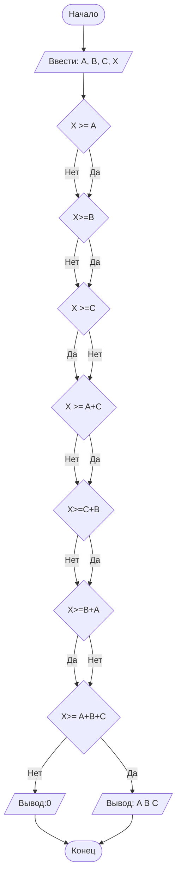

## Отчет по лабораторной работе № 1

#### № группы: `ПМ-2502`

#### Выполнила: `Ремизова Анастасия Александровна`

#### Вариант: `18`

### Cодержание:

- [Постановка задачи](#1-постановка-задачи)
- [Входные и выходные данные](#2-входные-и-выходные-данные)
- [Выбор структуры данных](#3-выбор-структуры-данных)
- [Алгоритм](#4-алгоритм)
- [Программа](#5-программа)
- [Анализ правильности решения](#6-анализ-правильности-решения)
### 1. Постановка задачи

> В лифт с грузоподъёмностью X пытаются загрузить грузы весом A, B, C.
Проверить, какие из грузов могут быть загружены в лифт без превышения
допустимой массы, и определить, сколько грузов можно поместить в лифт.
На вход программы подаются натуральные числа X, A, B, C.

Данную задачу можно разделить на 2 части: проверить грузы по отдельности, проверить поднимет ли лифт грузы вместе

- первая часть проверит помещаются ли грузы A, B, C по отдельности
    
- вторая часть программы проверяет поднимет ли лифт комбинации из 2 и 3 грузов:
  1. `A+B≤X`
  2.  `A+C≤X`
  3. `C+B≤X`
  4. `A+B≤X`
  5. `A+B+C≤X`

  Значит всего нужно рассмотреть 7 случаев: 3 одиночных, 3 по 2 и 1 все три груза.
  ### 2. Входные и выходные данные

#### Данные на вход

На вход программа должна получать 4 числа, при этом в условии сказано, к какому множеству
принадлежат получаемые числа- натуральные, поэтому приствоим им тип целых чисел, тк грузы весят целыми килограммами без грммов.

| Переменная | Тип          | min значение | max значение  |
|------------|--------------|--------------|---------------|
| X          | Целые числа  | 1            | 10<sup>9</sup> |
| A          | Целые числа  | 1            | 10<sup>9</sup> |
| B          | Целые числа  | 1            | 10<sup>9</sup> |
| C          | Целые числа  | 1            |10<sup>9</sup> |


#### Данные на выход

Т.к. программа должна проверить какие грузы могут быть загруженны и вывести количество помещаемых грузов. 

|                   | Тип                         | min значение | max значение   |
|-------------------|-----------------------------|--------------|----------------|
| количество грузов | целое неотрицательное число | 0            | 10<sup> 9</sup>

## 3. Выбор структуры данных

Программа получает 4 целых числа, не превышающих  10<sup>9</sup>. Поэтому для их хранения
можно выделить переменные А, B, C, X.

|   | название переменной | Тип (в Java) | 
|---|---------------------|--------------|
| X | `X`                 | `int`        |
| A | `A`                 | `int`     | 
| B | `B`                 | `int`     | 
| C | `C`                 | `int`     | 

Результаты можно выводить без дополнительного хранения.

### 4. Алгоритм

#### Алгоритм выполнения программы:

1. **Ввод данных:**  
   Считываем целые числа X,A,B,C.
2. **Проверка одиночных грузов:**  
   Для каждого груза A,B,C проверяем, меньше ли или равно ли его вес X. Если да — груз можно загрузить по отдельности.
3. **Проверка двойки:**
    - Проверяем сумму весов каждого из трёх возможных пар (A+B),(A+C),(B+C) — не превышает ли она X.
   
4. **Проверка тройки:**
   Проверяем сумму A+B+C — не превышает ли X.
5. **Определение максимального числа грузов:**
   Если можно загрузить все три — выводим 3.
   Иначе если можно загрузить любую пару — 2.
   Иначе если можно загрузить хотя бы один груз — 1.
   Иначе — 0 (ничего не подходит).
6. **Вывод результата:**  
   Выводим максимальное количество грузов, которое можно загрузить в лифт без перегруза.

#### Блок-схема



### 5. Программа
import java.util.Scanner;
public class Main
{
    public static void main(String[] args) {
        Scanner scanner = new Scanner(System.in);
System.out.print("Введите грузоподъёмность лифта X: ");
        int X = in.nextInt();

        System.out.print("Введите вес груза A: ");
        int A = in.nextInt();

        System.out.print("Введите вес груза B: ");
        int B = in.nextInt();

        System.out.print("Введите вес груза C: ");
        int C = in.nextInt();

        int maxCount = 0;
        String comb = "";

        // Проверка грузов по отдельности
        if (A <= X && 1 > maxCount) {
            maxCount = 1;
            comb = "A";
        }
        if (B <= X && 1 > maxCount) {
            maxCount = 1;
            comb = "B";
        }
        if (C <= X && 1 > maxCount) {
            maxCount = 1;
            comb = "C";
        }

        // Проверка комбинаций из 2 грузов
        if (A + B <= X && 2 > maxCount) {
            maxCount = 2;
            comb = "A B";
        }
        if (A + C <= X && 2 > maxCount) {
            maxCount = 2;
            comb = "A C";
        }
        if (B + C <= X && 2 > maxCount) {
            maxCount = 2;
            comb = "B C";
        }

        //  Проверка омбинации из трёх грузов
        if (A + B + C <= X && 3 > maxCount) {
            maxCount = 3;
            comb = "A B C";
        }

        // Вывод результата
        if (maxCount == 0) {
            System.out.println("В лифт нельзя загрузить ни один груз без превышения массы.");
        } else {
            System.out.println("Можно загрузить груз(ы): " + comb);
            System.out.println("Количество грузов, которые можно поместить: " + maxCount);
        }
    }
        
}

### 6. Анализ правильности решения

Программа работает корректно на всем множестве решений с учетом ограничений.
 1. Тест: грузоподъемность достаточна для всех трёх грузов
 Input:
  ```
    100 20 30 40
    ```

- Output:
    ```
    Груз A (вес 20) Груз B (вес 30) Груз C (вес 40) 3
    ```

2. Грузоподъемность позволяет загрузить только два из трёх грузов

- Input:
    ```
    50 20 30 40
    ```

- Output:
    ```
    Груз A (вес 20) Груз B (вес 30) 2
    ```
- Input:
    ```
   60 50 20 30
    ```
- Output:
    ```
    Груз B (вес 20) Груз C (вес 30) 2
    ```
- Input:
    ```
   150 100 140 30
    ```
- Output:
    ```
    Груз A (вес 100) Груз C (вес 30) 2
    ```
    

3. Грузоподъемность больше, чем вес одного груза или равен ему
- Input:
    ```
  30 50 30 20
    ```

- Output:
    ```
    Груз B (вес 30) Груз C (вес 20) 1
    ```
- Input:
    ```
   60 50 90 30
    ```
- Output:
    ```
    Груз  A (вес 50) Груз C (вес 30) 1
- Input:
    ```
   100 110 90 112
    ```
- Output:
    ```
    Груз A (вес 110) 1
    ```

4.  Грузоподъемность меньше веса всех грузов
- Input:
    ```
    10 20 30 40
    ```

- Output:
    ```
    0
    ```
5.Минимальные входные значения
- Input:
    ```
    1 1 1 1
    ```

- Output:
    ```
    Груз A (вес 1) Груз B (вес 1) Груз C (вес 1) 1
    ```


